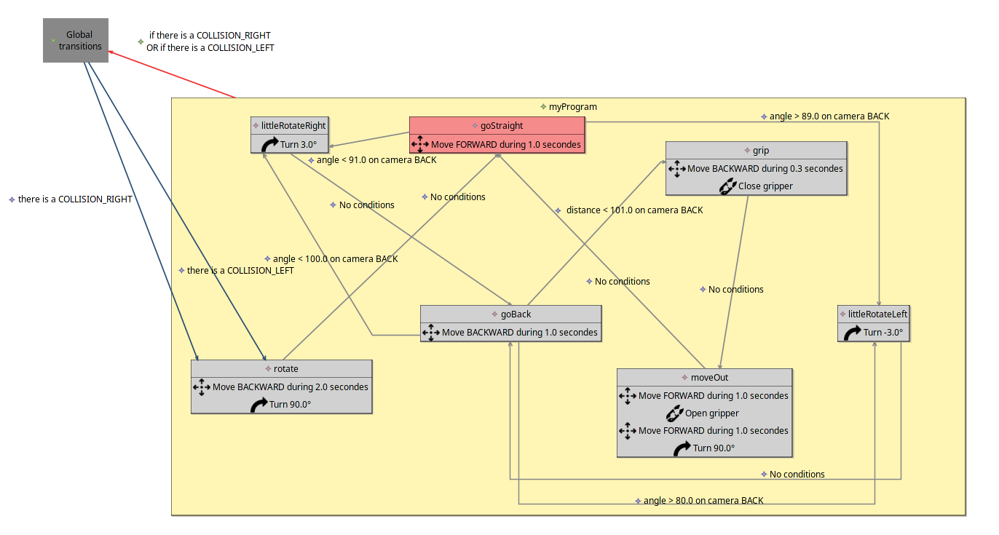
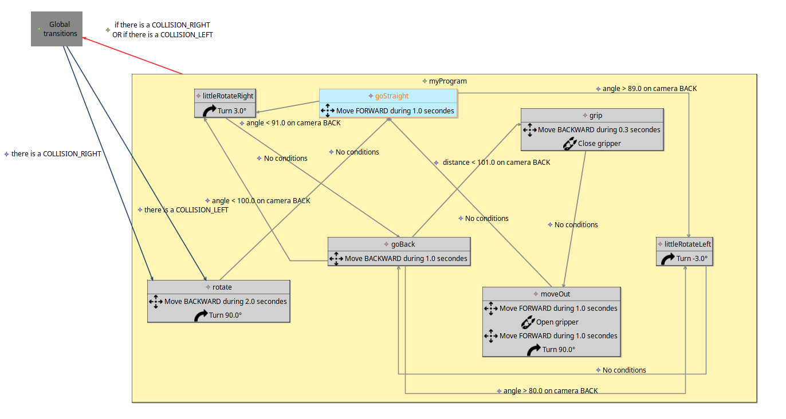
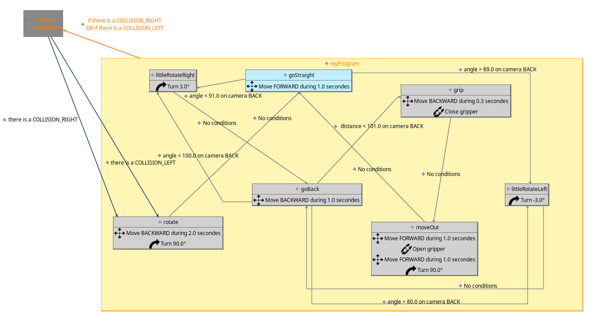
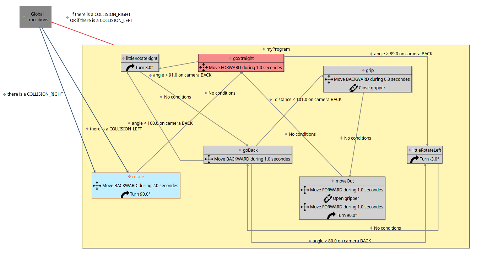

## Polycreate - Design 

### Affichage global
Nous avons mis en place un projet Design pour notre système afin de pouvoir avoir une visualisation des différents concepts via Sirius du côté du Modeling Workbench.

Vous trouverez des captures d'écran de notre design dans le dossier /examples à la source du répertoire global.

Nous avons défini un grand bloc correspondant à notre contexte global, représenté par un rectangle jaune. Il contient tous les états définis. On peut retrouver l'état initial en rouge pour commencer.  
Chaque état est représenté sous forme d'un rectangle et contient ses différentes actions. 
A partir d'un état, on peut visualiser les différentes transitions possibles représentées par une flèche vers un autre état. Les différentes conditions à respecter pour chaque transition sont également affichées au dessus des flèches ; dans le cas où il n'y a pas de conditions pour une transition, il est affiché "No conditions".

Le bloc global a une flèche rouge qui sort de celui-ci et se dirige vers un bloc nommé "Global transitions" dans le cas où notre programme a des transitions globales. Sur cette flèche, on peut retrouver les différentes conditions qui permettent de sortir de ce contexte global. Depuis le bloc "Global transitions", on peut retrouver plus particulièrement chacune des transitions globales représentée par une flèche bleue. Ces transitions ont une description des conditions à respecter au dessus de leur flèche.

### Affichage en mode debug
Lorsque le programme est écrit par l'utilisateur via notre syntaxe et que celui-ci est exécuté en mode "Debug", notre design s'anime.  
En effet, par défaut on peut retrouver l'état initial coloré en rouge. Durant le debug, nous avons choisi de différencier l'état courant par la couleur également et plus précisément avec la couleur bleue.  
On peut le voir avec cet exemple (tous les fichiers peuvent être retrouvés dans le dossier **../examples**). Lors du lancement du programme, l'état courant est l'état GoStraight par exemple.

La couleur orangée permet de représenter l'instruction en cours.  
Avec la seconde capture d'écran, lors du debuggage du programme, on voit ensuite que les instructions qui sont étudiées correspondent aux transitions globales.

Quand une condition d'une transition globale est vérifiée, on se retrouve dans un contexte externe "Global transitions" au contexte global du système.  

On peut voir pour finir, qu'une fois la transition globale réalisée, l'état courant est désormais l'état rotate.

Nous pensons que la mise en place de Sirius aide grandement le debuggage puisqu'à grâce aux différentes animations permettant de mettre en avant l'état dans lequel on se trouve par exemple, il est plus facile d'identifier les problèmes et leurs sources.